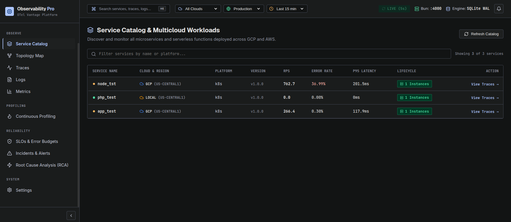
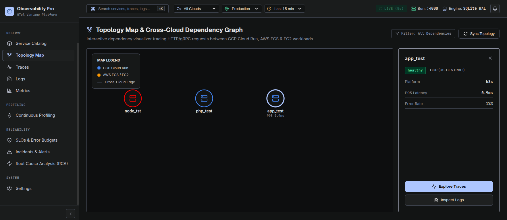
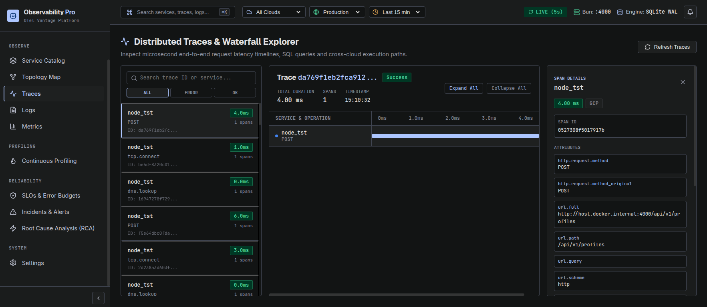
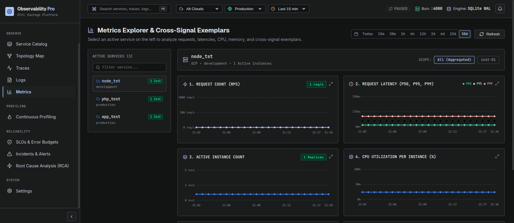
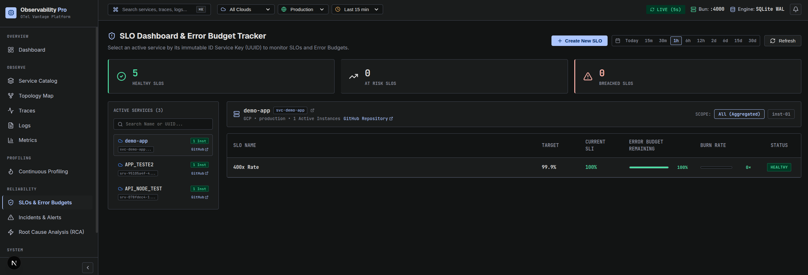
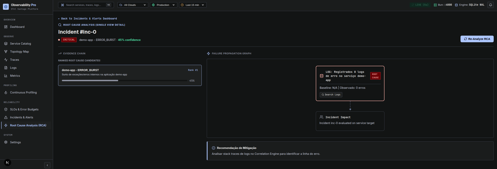
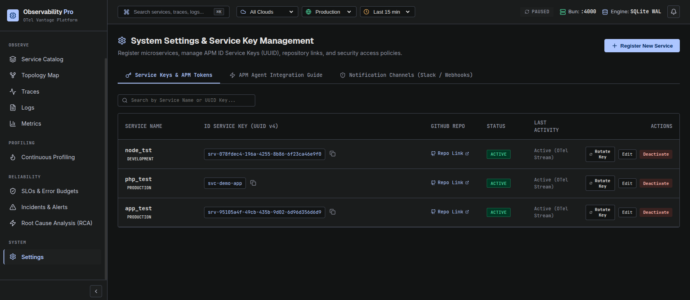

<p align="center">
  
</p>

<p align="center">
  <a href="https://rslucena.github.io/telemetry-platform/"></a>
  
  
  
  
  
  
</p>

<p align="center">
  <b>A modern, lightweight, and integrated observability platform for microservices, OTLP tracing, metrics, logs, SLOs, and automated Root Cause Analysis (RCA).</b>
</p>

---

## About the Product

**Telemetry Platform** is a complete distributed observability solution built on **OpenTelemetry (OTLP)** standards. Designed as a high-performance monorepo powered by **Bun** and **Next.js**, the system centralizes telemetry from distributed applications across multi-cloud environments (AWS, GCP, etc.).

The platform resolves the complexity of correlating scattered logs, tracing slow inter-microservice requests, and understanding real-time operational failure impacts—delivering rich visualizations and predictive analytics without relying on expensive SaaS platforms.

---

## Key Features

- **Service Catalog**: Real-time monitoring of RPS (Requests Per Second), P50/P95/P99 latencies, and service health status.
- **Cross-Cloud Topology Map**: Interactive SVG vector graph showing data flow and dependencies across microservices (GCP Cloud Run, AWS ECS, EC2, ElastiCache).
- **Trace & Span Waterfall**: In-depth inspection of OpenTelemetry spans with interactive waterfall charts to immediately pinpoint performance bottlenecks.
- **Correlated Structured Logs**: Unified log viewer with direct links to corresponding traces (`trace_id`).
- **SLO & Error Budget Management**: Tracking Service Level Objectives, availability targets, and error budget burn rates.
- **Incident & Alert Management**: Centralized detection and grouping of operational anomalies.
- **Automated Root Cause Analysis (RCA)**: Built-in correlation engine to accurately identify the root service causing incidents.
- **Performance Profiling**: Resource utilization analysis and function execution profiles.
- **Service Keys & Settings Management**: Centralized microservice registration, UUID key rotation, GitHub repository linking, and APM agent integration guides.

---

## Screenshots & System Overview

### Service Catalog (`/services`)
Centralized view of real-time metrics (RPS, P95 latencies, error rates, and microservice health).



---

### Cross-Cloud Topology (`/topology`)
Data flow graph and dependency mapping between microservices running on GCP Cloud Run, AWS ECS, EC2, and local environments.



---

### Trace & Span Waterfall (`/traces`)
Detailed analysis of distributed requests with interactive waterfall charts and per-span attribute inspection.



---

### Metrics Explorer (`/metrics`)
Visual exploration of Key Performance Indicators (KPIs), request rates, and latency distributions (P50, P95, P99).



---

### SLOs & Error Budgets (`/slos`)
Dashboard for Service Level Objectives, availability goals, and Error Budget burn rate tracking.



---

### Incidents & Root Cause Analysis (`/incidents`)
Central hub for operational anomaly detection, correlated alert grouping, and automated Root Cause Analysis (RCA).



---

### Service Keys & Settings (`/settings`)
Management interface for microservice registration, UUID key rotation, GitHub repository links, and APM agent integration guides.



---

## Tech Stack

### **Backend & API**
- **[Bun](https://bun.sh/)**: Ultra-fast JavaScript/TypeScript runtime for server execution.
- **`bun:sqlite`**: Embedded high-speed database for local telemetry storage.
- **TypeScript 5.7+**: End-to-end static typing.

### **Frontend & UI**
- **[Next.js 15](https://nextjs.org/)** (App Router): React framework with Server Components support.
- **React 19**: Modern reactive user interface.
- **Lucide React**: Clean and consistent vector iconography.
- **Vanilla CSS**: Responsive, performant, and modular styling.

### **Observability & Infrastructure**
- **OpenTelemetry (OTLP)**: Open standard for receiving telemetry data via gRPC/HTTP.
- **OpenTelemetry Collector**: Configurable metrics and traces collector and processor.
- **Docker Compose**: Containerization of auxiliary services and collectors.

### **Quality & Tooling (DevTools)**
- **[Biome](https://biomejs.dev/)**: Fast formatter and linter for JavaScript/TypeScript.
- **Bun Workspaces**: Modular monorepo management.

---

## Getting Started

### Prerequisites
- **[Bun](https://bun.sh/)** (version 1.0 or higher)
- **Docker** and **Docker Compose** *(optional, for running the OpenTelemetry Collector)*

---

### 1. Clone the Repository
```bash
git clone https://github.com/your-username/telemetry.git
cd telemetry
```

---

### 2. Install Dependencies
Using Bun Workspaces, install all monorepo dependencies with a single command:

```bash
bun install
```

---

### 3. Start Development Server (Backend + Frontend)
To launch the complete development environment in parallel:

```bash
bun run dev
```

Expected output:
- **Backend (Bun API)**: `http://localhost:4000`
- **Frontend (Next.js)**: `http://localhost:3000`

---

### 4. (Optional) Start OpenTelemetry Collector via Docker
To receive external OTLP gRPC (`4317`) or HTTP (`4318`) data:

```bash
docker compose up -d
```

---

## Database Initialization (SQLite)

**Telemetry Platform** uses **`bun:sqlite`** as an embedded local database.

- **Automatic Creation**: The database file (`telemetry.sqlite`) and all table schemas (`spans`, `metrics`, `logs`, `profiles`, `services`, `dependencies`, `slos`, `rca_reports`) are **automatically initialized** on the first launch of the backend server (`bun run dev`).
- **Git Ignore**: Database files (`*.sqlite`, `*.sqlite-wal`, `*.sqlite-shm`) and local agent configuration (`.agents/`) are configured in `.gitignore` to prevent committing sensitive or local state.
- **Database Reset**: To clear all telemetry data and reset the database from scratch, send a request to the reset endpoint or delete local files:
  ```bash
  # Via API:
  curl -X POST http://localhost:4000/api/v1/reset

  # Or removing local database files:
  rm telemetry.sqlite*
  ```

---

## Usage & Route Guide

### Frontend Dashboard Navigation
Access `http://localhost:3000` to inspect real-time observability data:

| Route | Description |
| :--- | :--- |
| `/services` | Service catalog with request rates (RPS), latencies, and health status. |
| `/topology` | Visual cross-cloud service architecture graph. |
| `/traces` | Detailed request tracing with interactive waterfall span views. |
| `/logs` | Structured logs view with direct correlation links to traces. |
| `/metrics` | Latency graphs by percentiles (P50, P95, P99). |
| `/slos` | Error Budget tracking and availability goals. |
| `/incidents` | Active incident and alert management panel. |
| `/root-cause` | Automated Root Cause Analysis (RCA) diagnosis. |

---

## Monorepo Structure

```text
telemetry/
├── opentelemetry/
│   ├── backend/            # REST API & OTLP Ingestion (Bun + bun:sqlite)
│   └── frontend/           # Dashboard UI (Next.js 15 + React 19)
├── packages/               # Shared TypeScript types and utilities
├── infrastructure/         # OpenTelemetry Collector configuration
├── docs/                   # Documentation and screenshots (images/)
├── .gitignore              # Ignores *.sqlite, node_modules, and .agents/
├── docker-compose.yml      # Collector Docker Compose setup
├── biome.json              # Biome lint and format configuration
└── package.json            # Monorepo global scripts
```

---

## Project Roadmap

- [x] OTLP HTTP/REST data ingestion
- [x] Local persistence with `bun:sqlite`
- [x] Reactive Next.js 15 App Router dashboard
- [x] Trace Waterfall viewer & Cross-Cloud Topology map
- [ ] Export support for analytical databases (ClickHouse / PostgreSQL)
- [ ] Alert notifications (Slack / Webhooks / PagerDuty)
- [ ] Advanced Flamegraphs support for Profiling

---

## License

This project is licensed under the [MIT](LICENSE) License - feel free to use, modify, and contribute!
