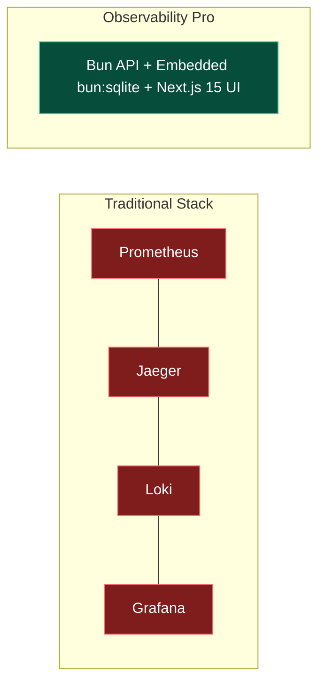

# Why Observability Pro?

Understanding the value proposition, architectural benefits, and trade-offs of **Observability Pro** compared to traditional enterprise observability stacks.

## The Problem with Enterprise Observability

Modern microservices architectures require visibility across multiple signals (Traces, Metrics, Logs, SLOs, and Profiling). However, traditional enterprise solutions present major friction points:

1. **Prohibitive SaaS Costs**: Commercial vendors (Datadog, New Relic, Dynatrace) charge per host, per gigabyte of logs, and per million custom metrics, leading to unpredictable monthly bills.
2. **Heavy Infrastructure Footprint**: Open-source alternatives (Grafana + Prometheus + Jaeger + Loki + Tempo) require maintaining 5+ separate databases and complex service clusters.
3. **Fragmented Navigation**: Engineers spend critical incident resolution time switching between disconnected tabs for logs, traces, and metrics.
4. **Data Privacy & Compliance**: Streaming raw telemetry logs to third-party cloud vendors introduces compliance risks for sensitive user data.

## The Observability Pro Solution

**Observability Pro (OTel Vantage Platform)** was built to solve these challenges with a single, ultra-lightweight, integrated suite:

- **Zero SaaS Fees**: Self-hosted on your own infrastructure or edge instances.
- **Embedded Storage (`bun:sqlite`)**: Sub-millisecond WAL mode storage without configuring external database nodes.
- **Correlated UI**: Single-click navigation from error logs to waterfall traces and root cause analysis.
- **Automated RCA Engine**: Algorithmic heuristic analysis pinpointing the exact failing dependency during outages.

## Comparison Matrix

| Feature | Observability Pro | SaaS Vendors (Datadog/New Relic) | DIY Open-Source (Grafana/Jaeger/Loki) |
| :--- | :---: | :---: | :---: |
| **Monthly Software Cost** | **$0 (Free & Open-Source)** | $$$$ (Usage-based pricing) | $0 (Self-hosted) |
| **Setup Time** | **< 2 minutes (`bun run dev`)** | Hours (SDK & Agent setup) | Days (Multi-service deployment) |
| **Database Overhead** | **Embedded (`bun:sqlite`)** | Managed Vendor Cloud | Heavy (ClickHouse, Cassandra, Loki) |
| **Automated RCA** | **Built-in Correlation Engine** | Add-on Enterprise Feature | Manual Correlation Required |
| **Data Privacy** | **100% On-Premise / In-House** | Shared Third-Party Cloud | 100% On-Premise |
| **Memory Footprint** | **< 150 MB RAM total** | Variable | 2+ GB RAM across containers |
